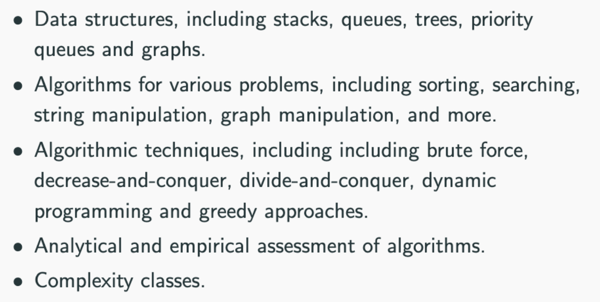
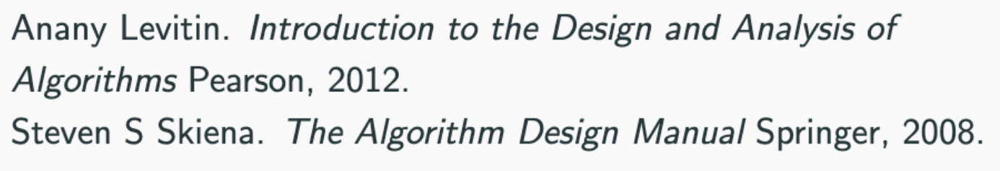
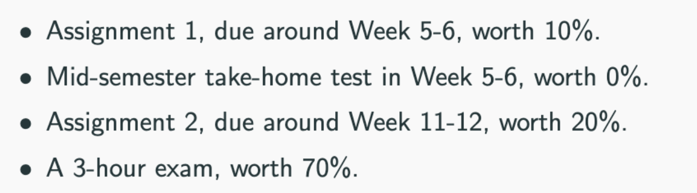
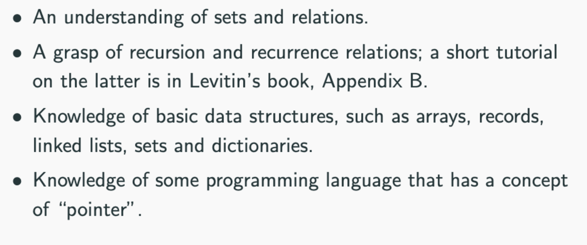

## Introduction to DOA
- Content

    - important algorithms for **sorting, searching, string processing, graph algorithms**
    - approaches to algorithm design **brute force, decrease and conquer, divide and conquer, transform and conquer**

- Textbooks

second one is easy to follow and lightweight, can find pdf online

- Assessments


- Assumed Knowledge


What is an algorithm?
An algorithm is a finite sequence of instructions that
- should work for all well-formed input
- should finish in a finite and *reasonable* amount of time
- should have no ambiguity and each step well-defined

Example - Euclid's GCD algorithm
- **note** that this algorithm also swaps m and n if m is smaller than n.
    - because for ```gcd(24, 60)```, first iteration makes ```r = 24 % 60 = 24```, so ```return gcd(60, 24)```
    - **note** that ```%``` is REMAINDER so since 60 can't fit into 24, the remainder is 24 NOT 0.
```
int gcd(m, n) {
    if (n==0) {
        return m;
    } else {
        // r is remainder
        r = m % n;
        return gcd(n, r);
    }
}
```
- pseudo-code
1. If n = 0, return m as the answer and stop (base case).
2. Divide m by n and assign the value of remainder to r.
3. Assign value of n to m, and value or r to n. Repeat step 1.

Computability
- some problems **do not** have **algorithmic solutions**.
- we only care about problems that **have** algorithmic solutions in this subject.
- keywords: **efficiency** and **complexity theory**

Problem Solving Steps
1. Understand the problem.
2. Decide on computational means (**sequential/parallel, exact/approximate**).
3. Decide on the method to use (**algorithm design technique/strategy, use of randomization**).
4. Design the necessary data structure and algorithm.
5. Check for correctness, trace example I/O.
6. Evaluate analytically (**time, space, best/average/worst time case**).
7. Code it (**implementation**).
8. Evaluate empirically.


