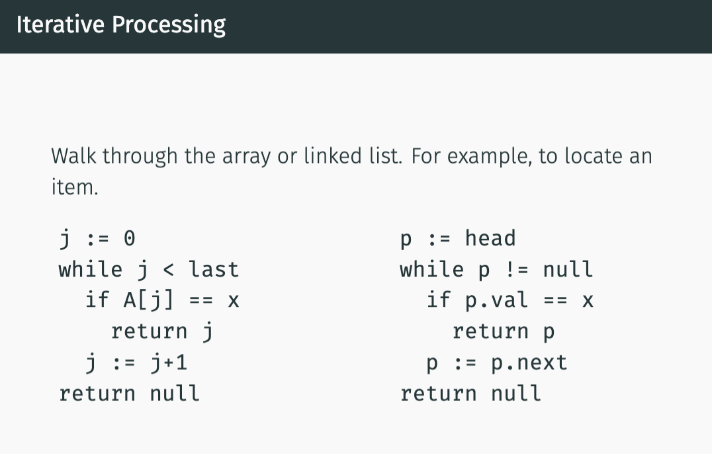
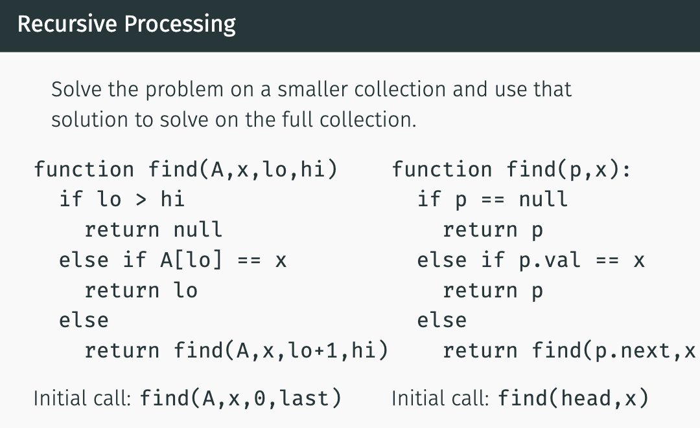

- use Leviton book as default
- read over chapter 1 and 2 in the first 2 weeks

### Abstract Data Types (ADT)
- not *actual* data structures like *array* (which is like defined).
- structures with a set of operations that you implement via defined data types.
- e.g. **stack** (FILO) and **queue** (FIFO) which can be implemented via. *arrays* or *linked list*.

### Must be able to pick any Data Structure and describe:
1. How to insert item
2. How to find item
3. How to handle duplicate items
4. How to delete item

### Examples of Data Structure Analysis
1. Arrays
- a sequence of consecutive cells in memory.
- **advantage**: very fast in inserting/finding/deleting data.
- **disadvantage**: maintaining a contiguous （连续的）bank of cells in memory is time-consuming and difficult.

2. Linked Lists
- a collection of objects with links to one another **can be in different parts of a computer's memory**.
- have a dummy head node that points at the first object in the linked list (or NULL if empty list).
- **advantage**: very fast in inserting/deleting item (by pointer arithmetic and changing links around, if you *already know the index of the item you want to insert or delete*).
- **disadvantage**: takes too long to find item (must go through every node in linked list).

### Iterative vs. Recursive Processing
**left** = array;  **right** = linked list;

 

